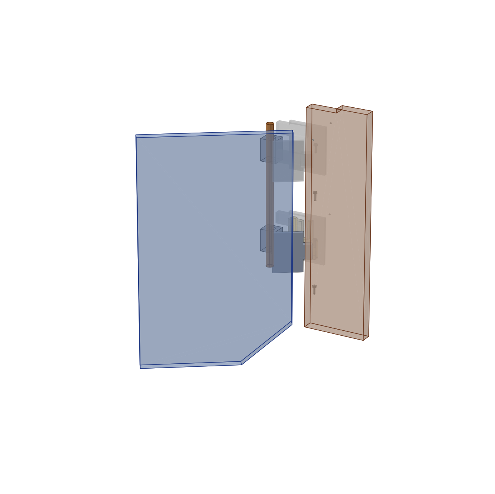
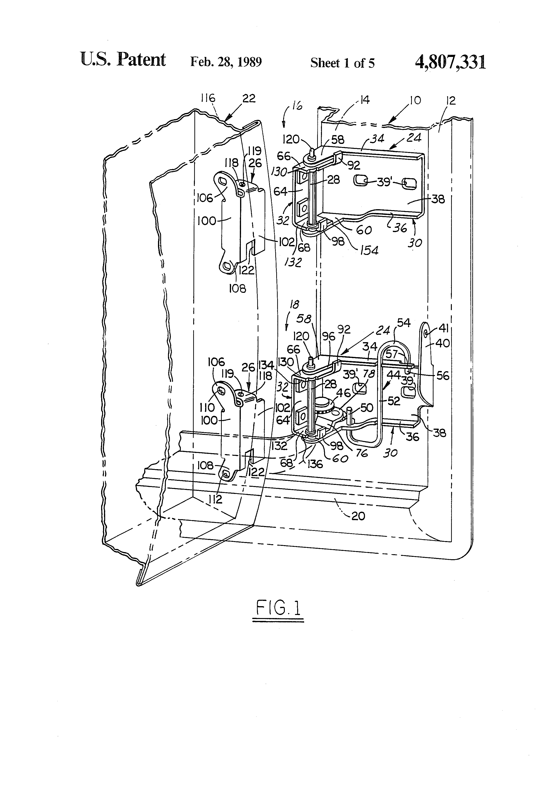
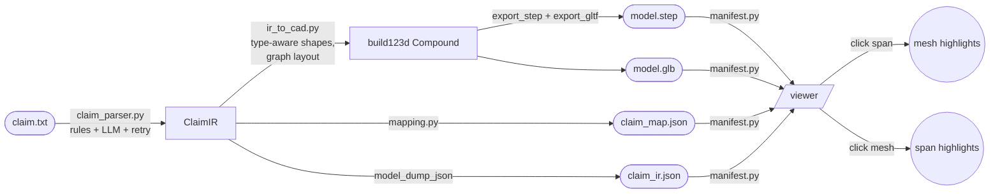
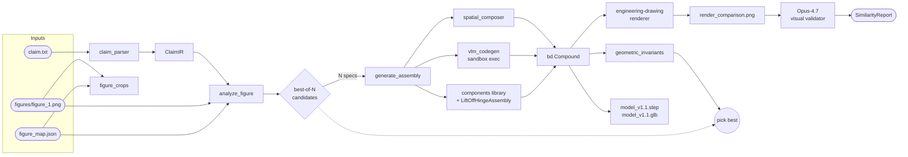
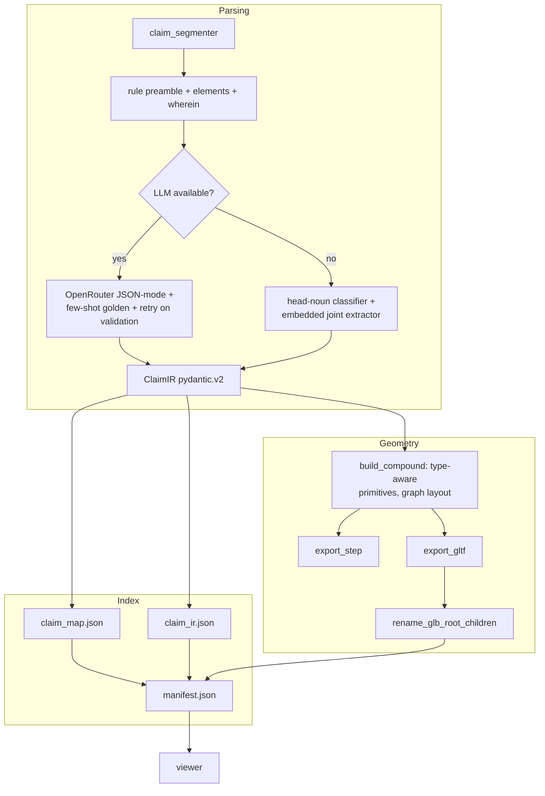

# Claim2CAD

> **From a patent claim to a clickable, figure-grounded 3D model.**
> Type a mechanical patent claim, get a structured intermediate
> representation, an editable build123d source file, a STEP + GLB
> model, and a viewer that bidirectionally links every claim
> element to its patent-figure region AND its 3D geometry.

[](https://github.com/sungwon-chae/claim2cad/actions/workflows/ci.yml)
[](https://www.python.org/)
[](https://github.com/gumyr/build123d)
[](LICENSE)

## v1.2 demo — US4807331A spring-loaded door hinge



| Patent figure | Claim2CAD v1.2 (oblique opened-door) |
| --- | --- |
|  |  |

The image on the right was generated automatically from the
patent claim text. The translucent blue plate is the door
swung open ~35° on its hinges; the translucent tan plate is the
vehicle body frame; the bronze vertical shaft is the pintle
pin; the steel-coloured clusters bridging the two are the
upper and lower hinge plates (door-side leaves on the door,
frame-side brackets on the frame). Every face links back to
its claim phrase via `claim_map.json` — clicking the upper
hinge plate in the viewer highlights "the upper extension of
the main member" in the claim panel and the corresponding
hotspot on the patent figure.

```bash
make demo-v12   # one command: builds + stages + opens the viewer
```

Open <http://localhost:4179>. The demo loads
US4807331A_spring_loaded_hinge by default. Click any callout
on the figure, any span in the claim, or any face in the 3D
scene — all three panels stay in sync.

**v1.2-dev** · honest patent-grounded reconstruction
* **Visual truth audit** (V12-A) — written critique of the v1.1
  output; identifies the central-pile failure mode honestly.
* **Figure-first layout lock** (V12-B) — hand-traced UV regions
  per group prevent the assembly from collapsing to a column.
* **Demo-quality scaffold** (V12-C) — patent-family-specific
  builder that produces recognisable hinge geometry, not bars.
* **Readable rendering** (V12-D) — per-mesh styling, transparent
  panels, silhouette outlines.
* **Productised viewer** (V12-E) — defaults to the demo example,
  Demo / Debug mode toggle, mode persisted in URL.
* **Hotspot tiers** (V12-F) — confidence_tier on every hotspot;
  demo mode hides low-tier markers.
* **Human-aligned eval** (V12-G) — figure_resemblance,
  panel_dominance, hinge_axis_visibility, floating_components,
  demo_readability. **Refuses credit for central piles.**
* **Perspective mismatch audit** (V12-I) — written critique of
  the v12-h flat front-only output.
* **Oblique opened-door scaffold** (V12-J/K) — door panel
  rotated ~35° about the pintle axis; door-side hinge plates
  rotate with the door, frame-side plates stay glued to the
  frame.
* **Patent-figure camera preset** (V12-L) — viewer defaults to
  the oblique three-quarter view that matches figure_1.png.
* **Readable oblique hero** (V12-M) — per-mesh colour, pintle
  shown in bronze, panels translucent so the hinge stays
  visible through them.

**Composite eval on US4807331A (V12-G):** `0.662`
(panel_dominance **1.00** · hinge_axis_visibility **1.00** ·
floating_components 0.56 · demo_readability 0.62 · v11_carryover
0.77). See `examples/reports/US4807331A_spring_loaded_hinge_v12_eval.md`.

**v1.1** kept for comparison — figure-grounded layout solver,
leader-line hotspot detection (95% on US4807331A), 289 tests.
**v1.0** kept for comparison — 30 examples, 101 tests, offline
demo unchanged.



---

## Why this is hard

Patent claims are **deliberately ambiguous about geometry** but **tightly
specific about structure**. A claim says "a first link rotatably mounted on
the base via a first revolute joint" — it doesn't say *how long* the link
is. Naively LLM-prompting "give me CAD" produces hallucinated dimensions
and unjustified shapes. Claim2CAD takes the opposite approach: capture
structure faithfully, place primitives that only commit to topology, and
make the **provenance** (which claim word produced which 3D mesh) the
first-class user-facing artifact.

Three concrete problems Claim2CAD solves:

1. **Hierarchical structure & wherein clauses.** Claims nest assemblies
   inside assemblies and qualify them with `wherein` modifiers. The IR
   captures both `parent_id` and `targets[]` so the viewer can expand or
   filter by claim element rather than by mesh ID.
2. **Independent vs. dependent.** Claim 2 ("…further comprising a position
   sensor…") adds geometry on top of claim 1. Claim2CAD distinguishes the
   two so the viewer can answer "what is the minimum invention?" with one
   toggle.
3. **Round-trip naming.** build123d's `export_gltf` does **not** preserve
   `Shape.label`s; it emits OCAF refs like `=>[0:1:1:2]`. Claim2CAD
   post-processes the GLB JSON chunk to rewrite the root-level node names
   to match component IDs, so the viewer's `mesh.name` lookup works
   reliably.

---

## Quickstart

### Offline demo (no API key required)

```bash
git clone https://github.com/sungwon-chae/claim2cad
cd claim2cad
make demo-clean-checkout    # provisions venv, regenerates 30 examples,
                            # builds the viewer — all from cached IR
make viewer-dev             # opens http://localhost:4179
```

`make demo-clean-checkout` is the hosted-demo path: it replays cached
`expected_ir.json` files instead of calling an LLM, so anyone with Python
3.11 + Node 20 can produce the full 3-pane viewer in a few minutes.

Switch examples in the header dropdown; click any underlined claim
element to highlight the matching 3D part (and vice-versa). Examples with
movable joints expose a "Joints (N)" slider panel; the multi-claim drone
example shows the 5-claim hierarchy in `claim_hierarchy.json`.

### Live LLM mode (your own claims)

```bash
cp .env.example .env          # then paste your OpenRouter key
make install                  # one-time (skip if make demo-clean-checkout already ran)
python -m claim2cad.pipeline --claim path/to/claim.txt --out path/to/out
```

Korean claims work transparently — the language is auto-detected. Pass
`--filter-claim N` to restrict the output to a single claim plus its
ancestors.

---

## What's new in v1.1 (in development)

v1.0 produced **topology-correct** CAD: claim words bound to mesh nodes,
but the geometry was a row of primitive Boxes and Cylinders. v1.1
upgrades the *visual fidelity* path while preserving the v1.0 contract.

| Phase | Module | Headline |
|---|---|---|
| V11-1 | `claim2cad/components/` | 12-entry parameterised mechanical library: plate, leaf, rod, l_bracket, u_bracket, pin, leaf_hinge, revolute_joint, prismatic_joint, spur_gear, ball_bearing, helical_spring |
| V11-2 | `claim2cad/visual_validator.py` | build123d tessellation + matplotlib rendering; Pillow side-by-side composite; Opus 4.7 vision call returns a `SimilarityReport` |
| V11-3 | `claim2cad/figure_to_cad.py` | One vision call analyses figure + IR, emits `figure_spec.json` with library_part / params / pose per component |
| V11-4 | `claim2cad/refinement_loop.py` | Validate → identify worst components → revise spec rows → rebuild; the **best**-scoring iteration wins |
| V11-5 | docs | `docs/V11_DESIGN.md` + `docs/VISUAL_VALIDATION_DESIGN.md` |
| V11-6 | `claim2cad/components/library.py` + `claim2cad/figure_crops.py` + `claim2cad/vlm_codegen.py` | Param aliases (route VLM-natural names to canonical fields), per-callout figure crops, sandboxed VLM build123d codegen |
| V11-7 | `claim2cad/spatial_composer.py` | One vision call rewrites every component's pose so shared axes line up |
| V11-8 | `claim2cad/ir_enricher.py` | Walks figure_map for unmapped numbered callouts and proposes new sub-feature components |
| V11-9 | `claim2cad/components/joints/lift_off_hinge.py` | Patent-family compound primitive: body-half bracket + nested U-link + door-half channel + pintle pin, all coaxial *by construction* |
| V11-10 | `claim2cad/geometric_invariants.py` + best-of-N + feature-edge renderer | CADFusion-style sampling, deterministic CAD-validity reward, engineering-drawing line strokes (silhouette + 32° creases) |
| V11-11 | `docs/V11_HARD_CASE_ANALYSIS.md` | Hard-case write-up with score history table |
| V11-12 | `claim2cad/figure_to_sketch.py` + `sketch_to_extrusion.py` | Outline-first 2.5D extrusion (flat) |
| **V11-13** | `claim2cad/span_relocator.py` | **Fix broken claim-text underlines: re-locate `source_span` by searching the label in the claim text. 0% → 97.7% verified across 30 examples.** |
| **V11-14** | `claim2cad/figure_view_classifier.py` + `shape_inference.py` + `assembly_solver.py` + `projection_compare.py` | **True 3D reconstruction: classify figure → infer shape_family + dims + pose + constraints per component → solver applies coaxial / passes_through / above / below to nest parts properly → render canonical views.** |
| V11-15 | `viewer/src/components/Scene.tsx` | Camera preset bar (top/front/right/iso) — best-match preset highlighted from `projection_report.json`. |
| V11-16 | `claim2cad/eval_v11.py` | 5-axis deterministic eval (span, GLB, callout coverage, geometric invariants, projection fit) — no VLM judge. |

### v1.1 architecture (figure-aware path)



### What's honest about v1.1

The figure-aware path makes the **CAD geometry materially more
faithful** to the patent figure (real U-brackets with side holes; pin
that provably threads through every coaxial hole; sub-features from
figure callouts). The **VLM-judge score on the hardest example
(US4807331A) is stuck at 3.0/10** — a real validator+spec ceiling for
that 1989 line drawing, not a build-quality issue. The hard-case
analysis documents this honestly with score history,
before/after renders, and the deterministic geometric-invariant
composite (which scores **0.92 / 1.00** on the same model — a fair
non-VLM check).

See `docs/V11_HARD_CASE_ANALYSIS.md` for the full write-up.

---

## What's new in v1.0

| Phase | Highlight |
|---|---|
| V1-1 | 25 real expired US mechanical patents (USPC 074, 901, 414, 16) |
| V1-2 | Baseline structural eval — 25/25 graded **good** at iteration 0 |
| V1-3 | VLM-based figure parsing (25/25 maps, 8/25 fully resolved) |
| V1-4 | 3-pane viewer with figure panel + manifest 0.2 |
| V1-5 | Prior-art comparison (4 demo diffs, fuzzy-match + LLM disambiguation) |
| V1-6 | URDF export + kinematic sliders (golden + PUMA demo) |
| V1-7 | Korean (KIPO/KIPRIS) claim support — head-final parser, romanisation |
| V1-8 | Multi-claim hierarchy ops + `--filter-claim` CLI + 5-claim drone example |
| V1-9 | Deterministic dimension extractor (EN+KO; values, ranges, comparatives) |
| V1-10 | Hosted-demo path: `make demo-clean-checkout`, no API key needed |
| V1-11 | Evaluation harness with JSON+Markdown reports, baseline numbers |

## Architecture

```
.
├── claim2cad/                 # Python pipeline (Pure Python, no LLM required at runtime)
│   ├── ir_schema.py           # pydantic v2 IR (the contract)
│   ├── lang.py                # language detection (V1-7)
│   ├── lang_ko.py             # Korean rules + Hangul→English head map (V1-7)
│   ├── claim_segmenter.py     # rule-based claim breakdown (EN + KO)
│   ├── claim_parser.py        # golden short-circuit + LLM + stub fallback
│   ├── claim_hierarchy.py     # multi-claim chain walk + IR filter (V1-8)
│   ├── dimension_extractor.py # explicit-value / range / comparative (V1-9)
│   ├── ir_to_cad.py           # IR → build123d Compound
│   ├── layout.py              # graph-based BFS layout
│   ├── glb_naming.py          # GLB node-names = component IDs
│   ├── mapping.py             # IR → claim_map.json
│   ├── manifest.py            # stages examples for the viewer
│   ├── pipeline.py            # CLI entry point
│   ├── prior_art.py           # bipartite-greedy fuzzy matcher (V1-5)
│   ├── urdf_export.py         # IR → URDF kinematic tree (V1-6)
│   ├── eval_harness.py        # benchmark harness (V1-11)
│   ├── figure_parser.py       # VLM-based figure label extraction (V1-3)
│   └── llm_client.py          # OpenRouter wrapper with backoff
├── examples/
│   ├── golden_robot_arm/      # hand-crafted ground truth (depth 2)
│   ├── hinge_assembly/        # 4-bar planar linkage
│   ├── planetary_gear/        # planetary gear stage (depth 2)
│   ├── korean_robot_arm/      # Korean-language manipulator (V1-7)
│   ├── multi_claim_drone/     # 5-claim quadrotor, depth 4 (V1-8)
│   └── real_patents/          # 25 real US mechanical patents (V1-1..V1-3)
├── viewer/                    # Vite + React + TypeScript + react-three-fiber
│   ├── src/components/
│   │   ├── ClaimPanel.tsx     # left pane: highlightable claim text
│   │   ├── FigurePanel.tsx    # centre/right pane: patent figure + hotspots
│   │   ├── KinematicSliders.tsx # joint sliders (V1-6)
│   │   ├── PriorArtOverlay.tsx  # diff overlay (V1-5)
│   │   └── Scene.tsx          # 3D scene, hover/click wiring
│   └── src/App.tsx            # 3-pane layout, dropdown, filter, sliders
├── tests/                     # pytest, 101 tests
├── docs/
│   ├── ARCHITECTURE_NOTES.md  # phase-1 reconnaissance
│   ├── IR_SCHEMA.md           # field-by-field IR walkthrough
│   ├── CAD_VIEWER_CONTRACT.md # GLB-name ↔ component-id contract
│   └── DESIGN_DECISIONS.md    # design decisions
├── logs/
│   ├── eval_report.{json,md}  # V1-11 dry-run baseline
│   └── eval_report_stub.{json,md} # V1-11 deterministic-parser baseline
└── Makefile                   # install / demo / test / eval / viewer-*
```

The pipeline is a Unix-philosophy chain:



---

## Examples

Each example bundles the input claim, the parsed IR, the build123d
generator, and the rendered model.

### `examples/golden_robot_arm/`
A 9-component articulated manipulator: base + first link + revolute joint
+ second link + revolute joint + end effector + gripper + fastener +
position sensor (dependent claim). Includes a hand-crafted ground-truth
generator alongside the pipeline-synthesized one for comparison.

### `examples/hinge_assembly/`
A 4-bar planar linkage: 4 links + 4 revolute joints, classified by the
rule-based stub parser without any LLM call.

### `examples/planetary_gear/`
A planetary gear stage: sun + ring + carrier + 3 planets, with a
dependent claim adding an input shaft.

### `examples/korean_robot_arm/` (V1-7)
A Korean-language (KIPO/KIPRIS-style) robot manipulator claim. Exercises
the head-final parser (head noun appears at the end of an element),
ordinal romanisation (제1 → first), and the trailing
`…를 포함하는 X.` preamble form.

### `examples/multi_claim_drone/` (V1-8)
A 5-claim quadrotor with hierarchy depth 4. Useful for the
`--filter-claim` flow: ask "what does claim 5 alone look like?" and the
pipeline emits CAD for `claim_5 → claim_4 → claim_3 → claim_1`,
correctly skipping sibling claim_2's battery.

### `examples/real_patents/` (V1-1..V1-3)
25 real expired US mechanical patents (USPC 074 transmission, 901 robot,
414 manipulator, 16 hinge). All graded **good** at iteration 0 of the
V1-2 baseline. 8/25 have full figure-mapping coverage from V1-3's VLM
pass.

---

## Limitations

These are deliberate v1.0 scope choices, not omissions:

- **Dimensions are placeholders for shape, not geometry.** V1-9 extracts
  explicit `"30 mm"` / `"between 10 and 20 mm"` / `"제1 링크보다 긴"`
  into the IR, but the CAD generator currently uses a single
  topological-primitive size per kind. Surfacing extracted dimensions
  to the CAD shapes is queued for v1.1.
- **Stub parser produces no relations.** Without an API key the
  rule-based fallback emits components + wherein clauses; relations
  fall back to a line-along-X layout. The eval harness shows this:
  multi-claim drone scores 0.18 / 0.00 in stub mode vs 1.0 in dry-run.
- **VLM coverage is partial.** 8/25 real patents have full
  component-to-figure-number mapping; 23/25 have at least one
  mapping. The 2 zero-mapping cases (US4106366A, US4470181A) need a
  spatial-bbox second signal — queued for v1.1.
- **Korean head-noun translation is small.** ~40 entries cover the
  common KIPO mechanical vocabulary. OOV terms slug to `comp_<n>`. Add
  domain words to `lang_ko.HEAD_TRANSLATIONS` as needed.
- **Single figure per patent.** Only `figure_1.png` is fed to the VLM.
  Multi-figure understanding is in the BACKLOG.
- **No browser-side selection memory.** Switching examples resets
  state.
- **No claim-chart generation** (claim-element ↔ accused-product
  table). Natural next step but out of scope for v1.0.

See `BLOCKERS.md` for the full open-items list and `BACKLOG.md` for
prioritised follow-ups.

---

## v1.1 demo (figure-grounded 3D path)

```bash
# Figure-grounded 3D reconstruction (V11-14, default mode):
python -m claim2cad.figure_to_cad \
    examples/real_patents/US4807331A_spring_loaded_hinge \
    --mode 3d --figure-scale-mm 200

# After the run, evaluate (no LLM calls):
python -m claim2cad.eval_v11 \
    examples/real_patents/US4807331A_spring_loaded_hinge
# Writes examples/reports/<id>_eval.{md,json}

# Stage to viewer + open:
make viewer-dev   # http://localhost:4179, switch to US4807331A,
                  # use the camera-preset bar to compare views.

# Older paths still work:
python -m claim2cad.figure_to_cad <ex> --mode outline   # 2.5D extrusion (V11-12)
python -m claim2cad.figure_to_cad <ex> --mode library   # legacy primitives
```

Generated artefacts (V11-14 / V11-15 / V11-16):

```
examples/<id>/
├── model_v1.1.{step,glb}            # 3D assembly
├── figure_view.json                 # view classification
├── shape_inference.json             # per-component shape+constraints
├── solver_diagnostics.json          # pose + bbox per part
├── projection_report.json           # canonical-view scores + best
├── render_comparison.png            # figure | CAD side-by-side
├── span_debug.md                    # span audit
├── renders_v1.1/projection_*.png    # top/front/right/iso
└── crops/                           # per-callout figure crops

examples/reports/<id>_eval.{md,json}  # 5-axis structural+visual report
```

### Why the eval no longer uses a VLM judge

The V11-1..11 attempts to break a "3.0/10 VLM-judge ceiling" on
US4807331A informed v1.1's design but didn't change the underlying
CAD enough. The honest move: stop chasing a noisy VLM-as-judge metric
and start measuring **structural** properties that match what a
patent-figure user actually cares about. V11-16's `eval_v11` does
this with five deterministic axes; see `docs/ARCHITECTURE.md` and
`docs/V11_HARD_CASE_ANALYSIS.md`.

## Roadmap (post-v1.0)

**v1.1 (in development)**:
- ~~Component library + figure-driven generation~~ (V11-1..V11-3)
- ~~Vision-grounded validation + refinement loop~~ (V11-2, V11-4)
- ~~VLM build123d codegen with sandbox~~ (V11-6)
- ~~Spatial composer + IR enrichment~~ (V11-7..V11-8)
- ~~Patent-family compound primitive~~ (V11-9)
- ~~CADFusion-style best-of-N + geometric invariants + engineering-drawing renderer~~ (V11-10)
- Apply the v1.1 path to a less-busy patent (next pass).
- Surface V1-9 dimensions to library-component params.
- Multi-figure VLM pass (combine figure_1 + figure_2 into one map).
- Browser-side selection memory (URL params or Zustand).
- Claim-chart export.

**v1.2+**:
- LLM parser emits explicit `revolute_joint` / `prismatic_joint`
  *components* (not just `rotates_about` relations) so URDFs from real
  patents pick up movable joints automatically.
- WIPO/EPO patent support (currently US-biased).
- Browser extension: highlight a patent on Google Patents → instant
  Claim2CAD view.
- Patent-to-FreeCAD-script (open source CAD ecosystem integration).

**Research**:
- Fine-tune a small model on patent claim → IR (avoid OpenRouter cost
  long-term).
- Prior-art search: given a claim, find related patents automatically.

---

## Troubleshooting

### macOS: `build123d` install fails with `OCP` errors
`build123d` depends on `cadquery-ocp`, which ships pre-built wheels for
Python 3.10–3.12 only. If `pip install build123d` errors with a build
failure on newer Pythons, install Python 3.11 via Homebrew
(`brew install python@3.11`) and re-run `python3.11 -m venv .venv`
before `make install`. The Makefile pins `python3.11`.

### macOS: GLB export warns "Unknown Compound type, color not set"
This warning comes from `build123d`'s STEP/glTF exporter and is harmless
— it happens when a Compound has no explicit colour. Output files are
generated correctly. The CI suite ignores it.

### Viewer: `npm install` fails with peer-dep errors
The viewer pins `react@18` + `three@0.160` + `@react-three/fiber@8`.
Newer combinations (R19 / three 0.161) may resolve but break our shader
includes. If `npm install` complains, run with `--legacy-peer-deps` or
delete `viewer/node_modules` + `viewer/package-lock.json` and retry.

### Viewer: page is blank after `npm run dev`
The viewer reads `viewer/public/data/manifest.json`, which is generated
by `python -m claim2cad.manifest`. Run `make viewer-dev` (which stages
the manifest first) instead of `cd viewer && npm run dev`.

### Pipeline: "OPENROUTER_API_KEY is not set"
You hit this when running `make demo` without an API key. Either:
1. Use `make demo-offline` (deterministic, replays `expected_ir.json`).
2. Copy `.env.example` to `.env` and paste your key.
The offline path requires every example to ship an `expected_ir.json`;
all 30 in this repo already do.

### Pipeline: claim parsed but components are sparse / mis-classified
The deterministic stub parser is a fallback. With an API key configured,
the LLM path produces richer IRs (relations, wherein clauses, accurate
classifications). For Korean claims specifically, the head-noun
extractor relies on the small `lang_ko.HEAD_TRANSLATIONS` dictionary —
out-of-vocabulary terms slug to `comp_<n>`. Add common terms to that
dict if your domain needs them.

---

## How it was built

This repo was assembled in 19 phases (Phases 1–7 for v0.1.0 + V1-0
through V1-11 for v1.0), each ending in a self-verifying checkpoint and
a git commit. The full phase-by-phase log is in `PROGRESS.md`.
Architecture decisions are in `docs/DESIGN_DECISIONS.md`. Per-release
highlights live in `RELEASE_NOTES.md`.

## Acknowledgments

- [build123d](https://github.com/gumyr/build123d) — the Python CAD library
  that handles STEP and glTF export.
- [text-to-cad](https://github.com/earthtojake/text-to-cad) — inspiration
  for the source-controlled CAD harness pattern.
- [react-three-fiber](https://github.com/pmndrs/react-three-fiber) and
  [drei](https://github.com/pmndrs/drei) — declarative three.js for React.
- [OpenRouter](https://openrouter.ai/) — model-agnostic LLM gateway.

## License

MIT — see `LICENSE`.
