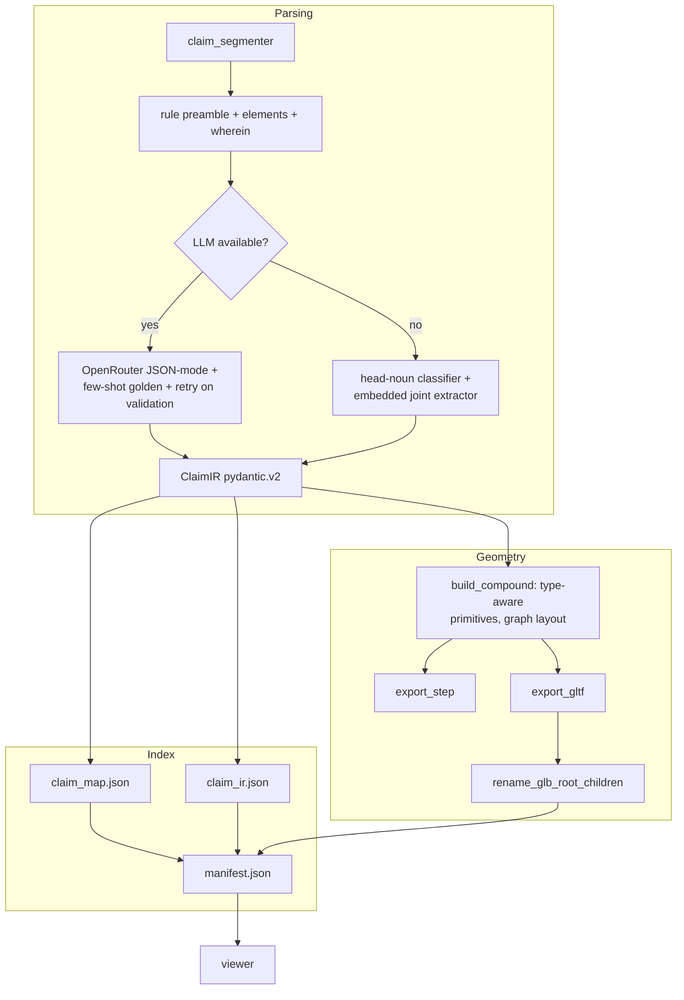

# Claim2CAD

> **From a patent claim to a clickable 3D model.**
> Type a mechanical patent claim, get a structured intermediate
> representation, an editable build123d source file, a STEP + GLB model,
> and a viewer that bidirectionally links every claim element to its 3D
> geometry.

[](https://github.com/sungwon-chae/claim2cad/actions/workflows/ci.yml)
[](https://www.python.org/)
[](https://github.com/gumyr/build123d)
[](LICENSE)


---

## Why this is hard

Patent claims are **deliberately ambiguous about geometry** but **tightly
specific about structure**. A claim says "a first link rotatably mounted on
the base via a first revolute joint" — it doesn't say *how long* the link
is. Naively LLM-prompting "give me CAD" produces hallucinated dimensions
and unjustified shapes. Claim2CAD takes the opposite approach: capture
structure faithfully, place primitives that only commit to topology, and
make the **provenance** (which claim word produced which 3D mesh) the
first-class user-facing artifact.

Three concrete problems Claim2CAD solves:

1. **Hierarchical structure & wherein clauses.** Claims nest assemblies
   inside assemblies and qualify them with `wherein` modifiers. The IR
   captures both `parent_id` and `targets[]` so the viewer can expand or
   filter by claim element rather than by mesh ID.
2. **Independent vs. dependent.** Claim 2 ("…further comprising a position
   sensor…") adds geometry on top of claim 1. Claim2CAD distinguishes the
   two so the viewer can answer "what is the minimum invention?" with one
   toggle.
3. **Round-trip naming.** build123d's `export_gltf` does **not** preserve
   `Shape.label`s; it emits OCAF refs like `=>[0:1:1:2]`. Claim2CAD
   post-processes the GLB JSON chunk to rewrite the root-level node names
   to match component IDs, so the viewer's `mesh.name` lookup works
   reliably.

---

## Quickstart

### Offline demo (no API key required)

```bash
git clone https://github.com/sungwon-chae/claim2cad
cd claim2cad
make demo-clean-checkout    # provisions venv, regenerates 30 examples,
                            # builds the viewer — all from cached IR
make viewer-dev             # opens http://localhost:4179
```

`make demo-clean-checkout` is the hosted-demo path: it replays cached
`expected_ir.json` files instead of calling an LLM, so anyone with Python
3.11 + Node 20 can produce the full 3-pane viewer in a few minutes.

Switch examples in the header dropdown; click any underlined claim
element to highlight the matching 3D part (and vice-versa). Examples with
movable joints expose a "Joints (N)" slider panel; the multi-claim drone
example shows the 5-claim hierarchy in `claim_hierarchy.json`.

### Live LLM mode (your own claims)

```bash
cp .env.example .env          # then paste your OpenRouter key
make install                  # one-time (skip if make demo-clean-checkout already ran)
python -m claim2cad.pipeline --claim path/to/claim.txt --out path/to/out
```

Korean claims work transparently — the language is auto-detected. Pass
`--filter-claim N` to restrict the output to a single claim plus its
ancestors.

---

## Architecture

```
.
├── claim2cad/                 # Python pipeline
│   ├── ir_schema.py           # pydantic v2 IR (the contract)
│   ├── claim_segmenter.py     # rule-based claim breakdown
│   ├── claim_parser.py        # golden short-circuit + LLM + stub fallback
│   ├── ir_to_cad.py           # IR → build123d Compound
│   ├── layout.py              # graph-based BFS layout
│   ├── glb_naming.py          # post-processes GLB so node names = component IDs
│   ├── mapping.py             # IR → claim_map.json
│   ├── manifest.py            # stages examples for the viewer
│   ├── pipeline.py            # CLI entry point
│   └── llm_client.py          # OpenRouter wrapper with backoff
├── examples/
│   ├── golden_robot_arm/      # hand-crafted ground truth
│   ├── hinge_assembly/        # 4-bar linkage
│   └── planetary_gear/        # 6-component planetary stage
├── viewer/                    # Vite + React + TypeScript + react-three-fiber
│   ├── src/components/
│   │   ├── ClaimPanel.tsx     # left pane: highlightable claim text
│   │   └── Scene.tsx          # right pane: GLB scene, hover/click wiring
│   └── src/App.tsx            # split layout, dropdown, limitation focus
├── tests/                     # pytest, 29 tests
├── docs/
│   ├── ARCHITECTURE_NOTES.md  # phase-1 reconnaissance of upstream text-to-cad
│   ├── IR_SCHEMA.md           # field-by-field IR walkthrough
│   ├── CAD_VIEWER_CONTRACT.md # the GLB-name ↔ component-id contract
│   └── DESIGN_DECISIONS.md    # 8 decisions and the reasoning
└── Makefile                   # install / demo / test / viewer-* targets
```

The pipeline is a Unix-philosophy chain:



---

## Examples

Each example bundles the input claim, the parsed IR, the build123d
generator, and the rendered model.

### `examples/golden_robot_arm/`
A 9-component articulated manipulator: base + first link + revolute joint
+ second link + revolute joint + end effector + gripper + fastener +
position sensor (dependent claim). Includes a hand-crafted ground-truth
generator alongside the pipeline-synthesized one for comparison.

### `examples/hinge_assembly/`
A 4-bar planar linkage: 4 links + 4 revolute joints, classified by the
rule-based stub parser without any LLM call.

### `examples/planetary_gear/`
A planetary gear stage: sun + ring + carrier + 3 planets, with a
dependent claim adding an input shaft.

---

## Limitations & future work

- **No auto-dimensioning.** Geometry is topologically correct but
  dimensions are placeholders. The IR's `dimension` field accepts numeric
  values; the parser just rarely populates them because most claims don't
  specify.
- **No figure parsing.** Patent figures and reference numerals (e.g.
  "the link 12") are out of scope for v0.1.
- **No claim-chart generation.** Claim2CAD takes claim text in; producing
  claim-chart output (claim-element ↔ accused-product mapping) is a
  natural next step.
- **Stub parser misses relations.** When the LLM is unavailable, the
  rule-based fallback emits components and wherein clauses but no
  `Relation` rows. The layout engine falls back to line-along-X. See
  `BLOCKERS.md` B-005.
- **No browser-side selection memory.** Switching examples resets state;
  a Zustand or URL-param store could keep selection sticky.

See `BLOCKERS.md` for the full open-items list.

---

## Troubleshooting

### macOS: `build123d` install fails with `OCP` errors
`build123d` depends on `cadquery-ocp`, which ships pre-built wheels for
Python 3.10–3.12 only. If `pip install build123d` errors with a build
failure on newer Pythons, install Python 3.11 via Homebrew
(`brew install python@3.11`) and re-run `python3.11 -m venv .venv`
before `make install`. The Makefile pins `python3.11`.

### macOS: GLB export warns "Unknown Compound type, color not set"
This warning comes from `build123d`'s STEP/glTF exporter and is harmless
— it happens when a Compound has no explicit colour. Output files are
generated correctly. The CI suite ignores it.

### Viewer: `npm install` fails with peer-dep errors
The viewer pins `react@18` + `three@0.160` + `@react-three/fiber@8`.
Newer combinations (R19 / three 0.161) may resolve but break our shader
includes. If `npm install` complains, run with `--legacy-peer-deps` or
delete `viewer/node_modules` + `viewer/package-lock.json` and retry.

### Viewer: page is blank after `npm run dev`
The viewer reads `viewer/public/data/manifest.json`, which is generated
by `python -m claim2cad.manifest`. Run `make viewer-dev` (which stages
the manifest first) instead of `cd viewer && npm run dev`.

### Pipeline: "OPENROUTER_API_KEY is not set"
You hit this when running `make demo` without an API key. Either:
1. Use `make demo-offline` (deterministic, replays `expected_ir.json`).
2. Copy `.env.example` to `.env` and paste your key.
The offline path requires every example to ship an `expected_ir.json`;
all 30 in this repo already do.

### Pipeline: claim parsed but components are sparse / mis-classified
The deterministic stub parser is a fallback. With an API key configured,
the LLM path produces richer IRs (relations, wherein clauses, accurate
classifications). For Korean claims specifically, the head-noun
extractor relies on the small `lang_ko.HEAD_TRANSLATIONS` dictionary —
out-of-vocabulary terms slug to `comp_<n>`. Add common terms to that
dict if your domain needs them.

---

## How it was built

This repo was assembled in seven phases, each ending in a self-verifying
checkpoint and a git commit. The full phase-by-phase log is in
`PROGRESS.md`. The architecture decisions are in
`docs/DESIGN_DECISIONS.md`.

## Acknowledgments

- [build123d](https://github.com/gumyr/build123d) — the Python CAD library
  that handles STEP and glTF export.
- [text-to-cad](https://github.com/earthtojake/text-to-cad) — inspiration
  for the source-controlled CAD harness pattern.
- [react-three-fiber](https://github.com/pmndrs/react-three-fiber) and
  [drei](https://github.com/pmndrs/drei) — declarative three.js for React.
- [OpenRouter](https://openrouter.ai/) — model-agnostic LLM gateway.

## License

MIT — see `LICENSE`.
