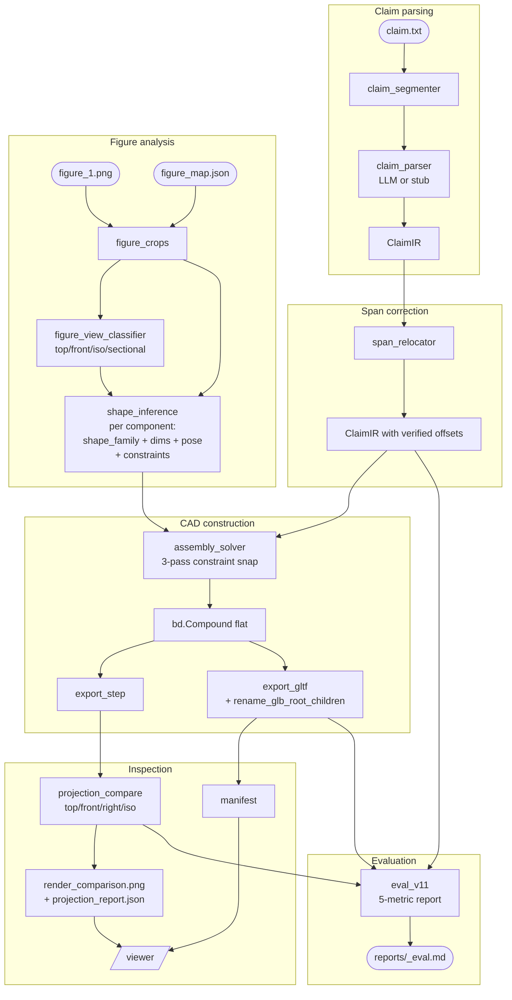

# Claim2CAD — Architecture

Claim2CAD is **claim ↔ figure ↔ CAD grounding**, not "text-to-CAD".
The architecture has three concentric loops, each preserving a
contract that the next layer relies on.

## Three contracts

```
       claim_text                       figure_1.png + figure_map.json
            │                                       │
            ▼                                       ▼
       ClaimIR (pydantic)             FigureViewReport + ShapeInferenceSet
            │                                       │
            └────────────┬──────────────────────────┘
                         ▼
               build123d Compound (flat)
                         │
                ┌────────┴───────┐
                ▼                ▼
           model.step       model.glb
                                 │
                                 ▼
                        viewer (React + r3f)
```

1. **Span contract.** Every IR Component has a ``source_span`` that
   points at a real substring of the claim text. The viewer's
   underline-on-hover/click depends on this. Broken in v1.0 (LLM
   offsets drifted); fixed in V11-13 by the
   :mod:`claim2cad.span_relocator` post-processor that searches the
   label in the claim text directly with a token-set fallback.

2. **GLB-naming contract.** Every IR component_id appears as a
   top-level GLB node with the same name. The viewer's
   ``getObjectByName`` lookup depends on this. Preserved across all
   build paths (library, codegen, outline-extrusion, 3D solver) by
   composing into a flat ``bd.Compound`` and post-processing the GLB
   JSON chunk in :mod:`claim2cad.glb_naming`.

3. **Figure-CAD correspondence.** When a figure is available, the
   CAD must (a) be genuinely 3D, not a flat collage, and (b) project
   onto at least one canonical camera angle whose silhouette matches
   the figure layout. V11-14's solver provides (a) by enforcing
   coaxial / nested / above-below constraints; V11-15's projection
   compare provides (b) by rendering top/front/right/iso and saving
   the best aspect-match view.

## Pipeline stages



## Module map

| Module | Phase | Role |
|---|---|---|
| `claim2cad/claim_parser.py` | V1-2 | LLM/rule-based parser → ``ClaimIR`` |
| `claim2cad/span_relocator.py` | V11-13 | Re-locate ``source_span`` to actual substrings |
| `claim2cad/mapping.py` | V1-3 | ``claim_map.json`` (with ``span_verified`` since V11-13) |
| `claim2cad/figure_crops.py` | V11-6 | Per-callout figure crops |
| `claim2cad/figure_view_classifier.py` | V11-14 | Detect top/front/iso/sectional |
| `claim2cad/shape_inference.py` | V11-14 | Per-component shape_family + dims + pose + constraints |
| `claim2cad/assembly_solver.py` | V11-14 | 3-pass constraint solver, flat ``Compound`` |
| `claim2cad/glb_naming.py` | V1-2 | GLB root-child renaming (preserves ``component_id``) |
| `claim2cad/visual_validator.py` | V11-2/V11-10 | Engineering-drawing renderer (silhouette + 32° crease) |
| `claim2cad/projection_compare.py` | V11-14 | Render top/front/right/iso + best-match scoring |
| `claim2cad/geometric_invariants.py` | V11-10 | Deterministic CAD-validity reward |
| `claim2cad/eval_v11.py` | V11-16 | 5-metric structural+visual report |
| `viewer/src/components/Scene.tsx` | V11-15 | Camera presets (top/front/right/iso/best) |

## Fallback ladders

The pipeline is forgiving — missing inputs degrade gracefully.

* **No LLM key**: ``--dry-run`` replays cached ``expected_ir.json``;
  the rest of the pipeline runs deterministic-only (rule-based span
  relocator, primitive CAD).
* **No figure_map**: 3D-mode skips shape_inference and projection_compare;
  outline-first skips polygon tracing; library/codegen still produce a
  CAD with topologically-correct geometry.
* **3D-mode failure** (sandbox exec error, malformed VLM JSON): falls
  back to outline-first, then to library/codegen, then to v1.0
  primitives. Each step logs a WARNING so the user can see which
  layer caught the problem.

## What runs without LLM calls

| Stage | LLM-free? |
|---|:---:|
| Parser (`--dry-run`) | ✓ |
| `span_relocator` | ✓ |
| `glb_naming` | ✓ |
| `geometric_invariants` | ✓ |
| `projection_compare` | ✓ (silhouette-based, no judging VLM) |
| `eval_v11` | ✓ |
| `figure_view_classifier` | ✗ (one VLM call per figure, cached) |
| `shape_inference` | ✗ (one VLM call per component, cached) |
| `figure_to_sketch` (outline mode) | ✗ (one VLM call per component, cached) |

The cached JSONs (`figure_view.json`, `shape_inference.json`,
`outline_set.json`) make subsequent runs free.

## Honest limitations

* **Patent figures vary.** Sectional cuts and exploded views need
  per-component view hints we don't yet capture.
* **Single figure per example.** Multi-figure context is in
  `_compose_multi_figure` but the shape inference still treats one
  crop at a time.
* **No mesh-level Boolean from sketch.** The solver generates
  primitive 3D shapes per family; for parts with very specific
  profiles (e.g. a leaf flange with a particular cut-out), the
  outline-extrusion fallback (V11-12) carries the polygon profile but
  loses the 3D depth nesting. A hybrid path (polygon profile + Z
  layering from the solver) is queued.
* **VLM-judge scoring** sits at a hard ceiling on busy 1989-style
  hand-drawn figures. The 5-metric `eval_v11` report is the honest
  alternative.

See `docs/V11_HARD_CASE_ANALYSIS.md` for the US4807331A case study.
