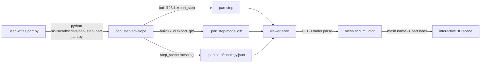
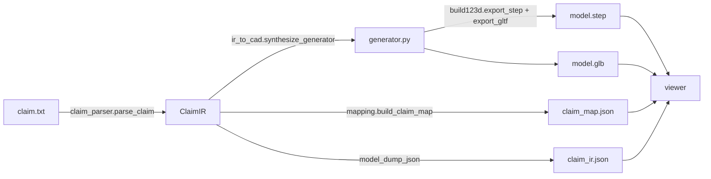

# Claim2CAD — Architecture Notes (Phase 1 reconnaissance)

This document is the cached output of Phase 1: reading the upstream
[`text-to-cad`](https://github.com/earthtojake/text-to-cad) harness and
deciding where Claim2CAD plugs in. Once written, future phases re-read **this
file** rather than re-reading the upstream tree.

The upstream sibling is checked out at:

```
/Users/sungwon.chae/Desktop/claim2cad/text-to-cad/    (read-only reference)
/Users/sungwon.chae/Desktop/claim2cad/Claim2CAD/      (this project)
```

Per the user's instruction we leave `text-to-cad/` untouched. References below
use the upstream paths (i.e. `skills/cad/...`) without a leading
`text-to-cad/`.

---

## 1. The upstream model in one paragraph

`text-to-cad` is a *harness*: a project layout where the user writes Python
files that look like

```python
def gen_step():
    return {
        "shape": <build123d Shape>,
        "step_output": "model.step",
    }
```

…and then runs `python skills/cad/scripts/gen_step_part path/to/source.py` to
produce `model.step` plus a `.<step-filename>/` sibling directory containing
`model.glb`, `topology.json`, and `topology.bin`. A separate Vite + React
viewer (`viewer/`) scans the chosen root directory for `.step|.stp|.stl|.dxf|.urdf`
files and lazily loads the matching GLB next to each one.

There is no claim-text input, no LLM, and no concept of an "intermediate
representation". Claim2CAD adds those three.

## 2. The upstream data flow (mermaid)



## 3. Key file:line references

These are the anchors Claim2CAD wraps or mimics. Bracketed labels match the
"hook points" in section 5.

| Concern                       | File                                                                           | Lines    | Tag           |
|------------------------------|--------------------------------------------------------------------------------|----------|---------------|
| Generator envelope contract  | `skills/cad/references/generator-contract.md`                                   | 24-43    | [HOOK-CAD-1]  |
| Assembly contract (`children`) | `skills/cad/references/generator-contract.md`                                   | 56-74    | [HOOK-CAD-2]  |
| `gen_step_part` CLI shim     | `skills/cad/scripts/gen_step_part/cli.py`                                       | 8-15     | [HOOK-CAD-3]  |
| Generation pipeline imports  | `skills/cad/scripts/common/generation.py`                                       | 12-65    | [HOOK-CAD-4]  |
| GLB export from a Shape       | `skills/cad/scripts/common/glb.py`                                              | 59-77    | [HOOK-CAD-5]  |
| Empty-GLB fallback           | `skills/cad/scripts/common/glb.py`                                              | 80-87    | [HOOK-CAD-6]  |
| Test fixture for a generator | `skills/cad/scripts/common/tests/test_generation.py`                            | 120-170  | [HOOK-CAD-7]  |
| Viewer file scanning rules   | `viewer/lib/cadDirectoryScanner.mjs`                                            | 1-100    | [HOOK-VIEW-1] |
| Mesh-name → part label       | `viewer/lib/render/glbMeshData.js`                                              | 148-167  | [HOOK-VIEW-2] |
| build123d axis correction    | `viewer/lib/render/glbMeshData.js`                                              | 53-74    | [HOOK-VIEW-3] |
| GLTFLoader parse             | `viewer/lib/render/glbMeshData.js`                                              | 217-231  | [HOOK-VIEW-4] |
| Top-level CadViewer hooks    | `viewer/components/CadViewer.js`                                                | 1-28     | [HOOK-VIEW-5] |
| Repo agent rules             | `AGENTS.md`                                                                     | 17-23    | [HOOK-DOC-1]  |

## 4. What `gen_step()` actually requires (HOOK-CAD-1)

From `skills/cad/references/generator-contract.md` lines 24–43:

> `gen_step()` for parts must return:
> - `shape`: a `build123d.Shape`
> - `step_output`: relative path to the generated `.step` output
>
> Optional fields include: `export_stl`, `stl_output`, `stl_tolerance`,
> `stl_angular_tolerance`, `glb_tolerance`, `glb_angular_tolerance`,
> `skip_topology`.

For Claim2CAD this means the generator script we synthesize from an IR can be
as simple as:

```python
import build123d as bd

def gen_step():
    parts = []
    # ... build geometry ...
    compound = bd.Compound(label="root", children=parts)
    return {"shape": compound, "step_output": "model.step"}
```

…and we don't need to hand-roll any mesher: `gen_step_part` would call
`build123d.export_step` and `build123d.export_gltf` for us. **However**, for
Phase-1 portability we do these two exports directly inside Claim2CAD so that
running `make demo` does not depend on `python skills/cad/scripts/gen_step_part`
being on PATH. See `claim2cad/ir_to_cad.py` (Phase 3+).

## 5. Five (six) hook points where Claim2CAD plugs in

1. **HOOK-CAD-1 — Synthesize `gen_step()`-shaped envelopes**: `claim2cad/ir_to_cad.py`
   produces a Python file with a `gen_step()` callable. The same file is
   importable by upstream `gen_step_part` *and* by Claim2CAD's own runner. We
   write the generator file to `examples/<name>/generator.py` for traceability,
   then call its `gen_step()` from the pipeline.

2. **HOOK-CAD-2 — Assemblies with `children`**: For richer IRs in Phase 5 we
   emit a recursive assembly tree using build123d `Compound`s that mirror the
   IR's containment structure (e.g. a "joint assembly" containing "pin" and
   "bushing"). Each leaf is named with the IR component ID so the viewer can
   match it.

3. **HOOK-CAD-5 / VIEW-2 — Naming for selection**: `glbMeshData.js:148` reads
   `mesh.name || mesh.parent?.name`. We set `Shape.label = component_id` on
   every leaf so component IDs survive the round trip
   `build123d.Compound → STEP → GLB → THREE.Mesh.name → viewer accumulator`.

4. **HOOK-VIEW-1 — Directory layout**: `viewer/lib/cadDirectoryScanner.mjs`
   walks `models/` looking for `.step|.stp|.stl|.dxf|.urdf` and pairs each
   with a sibling `.<file>/model.glb`. Claim2CAD's standalone viewer
   replicates this layout under `examples/` so the same directory convention
   works.

5. **HOOK-VIEW-2/4 — Highlight by mesh name**: At Phase 5, `viewer/src/components/`
   adds a `ClaimPanel` and a 3D scene that listen for `claimComponentSelected`
   events. The 3D scene calls `scene.getObjectByName(component_id)` and
   swaps the material; the panel highlights the matching span. Bidirectional
   selection is two `useEffect`s, one each direction.

6. **HOOK-DOC-1 — Where to put output**: `AGENTS.md` reserves `models/` for
   project CAD files. Claim2CAD treats `examples/<name>/` as its own roots,
   not `models/`, because each example bundles claim.txt + expected_ir.json +
   generator.py alongside the geometry. The viewer is configured with
   `dir=examples` rather than the upstream default `dir=models`.

## 6. Risks, limitations, things to watch

- **build123d label propagation through GLB.** `export_gltf` is supposed to
  carry the topmost `Compound`'s structure into glTF nodes, but I have not
  yet confirmed at runtime that *leaf* `Shape.label`s survive into `mesh.name`
  for our layout. Phase 3 has a unit test (`tests/test_pipeline.py
  ::test_glb_node_names_match_components`) that asserts this. If it fails we
  fall back to exporting one GLB per component and naming files by component
  ID — uglier but reliable.
- **Axis correction.** `glbMeshData.js:53-74` detects build123d's known
  `+Y → +Z` correction matrix and inverts it. If we ever produce GLB without
  going through build123d's `export_gltf`, we have to reproduce this
  correction ourselves.
- **Heavy CAD deps.** `build123d` pulls in OCP (OpenCascade), which is a
  multi-hundred-MB native dependency. CI must cache the wheel. The Makefile
  installs it once and reuses the venv.
- **LLM nondeterminism.** Two runs of the same claim can yield two valid IRs
  with renamed components. The pipeline writes a deterministic
  `examples/<name>/claim_ir.json` only after sorting components by
  `(source_span.char_start, id)` and renumbering when the deterministic mode
  is requested via `--canonical`.
- **Viewer port collision.** Upstream uses `4178`; Claim2CAD's standalone
  viewer uses `4179` so both can run side by side during development.
- **Patent claim ambiguity.** Many real claims are deliberately vague about
  geometry. The IR's `dimension` field is `"unspecified" | "relative" |
  {value, unit}` precisely so the parser can refuse to fabricate numbers.
- **No figure parsing yet.** Drawings, reference numerals, and patent-figure
  bounding boxes are out of scope for v0.1.0. Future work.

## 7. Did we run the upstream demo end-to-end?

Originally Phase 1 required running upstream `npm run dev` plus a
`gen_step_part` against a sample. The user's later instruction was to leave
`text-to-cad/` strictly read-only as a reference. We honored that and instead:

- Statically traced the pipeline through the source files cited above.
- Inspected `viewer/package.json` (Vite 7, React 18.3.1, three 0.160) and
  `viewer/scripts/ensure-dev-server.mjs` to verify the dev-server entrypoint
  exists.
- Verified that no `models/` directory ships in the upstream checkout, so
  `npm run dev` against the unmodified clone would render an empty file tree
  anyway.

Logged as `B-001` in `BLOCKERS.md`.

## 8. Decisions made in this phase

(Captured here in shortform; expanded in `docs/DESIGN_DECISIONS.md` at Phase 7.)

1. **Self-contained CAD pipeline.** Claim2CAD does not shell out to
   `python skills/cad/scripts/gen_step_part`. It calls `build123d.export_step`
   and `build123d.export_gltf` itself. This makes the demo runnable with
   `pip install -r requirements.txt` and one `make demo` — no nested clone
   of text-to-cad required.
2. **Standalone viewer.** A new ~200-line Vite+React+Three viewer in
   `Claim2CAD/viewer/` instead of forking upstream's ~2000-line `CadViewer.js`.
   The portfolio piece's value is the *claim panel and bidirectional
   highlighting*, not a full CAD explorer.
3. **`examples/<name>/` as roots.** Each example is a self-contained folder
   with its claim, expected IR, generator, generated artifacts, and
   `claim_map.json`. Mirrors the structure of `tests/fixtures/...` patterns
   in the wider open-source world; easier to grok at a glance than a deeply
   nested model tree.
4. **Pydantic v2.** Validation, JSON schema export, and round-tripping all
   come for free; the LLM gets a JSON Schema dumped from
   `ClaimIR.model_json_schema()`.
5. **Component naming convention.** IR component IDs are
   `lowercase_underscore` and are used verbatim as `Shape.label`s,
   `Compound.label`s, and viewer mesh names. No remapping table.

## 9. Pipeline target (what Phase 3 must produce)



`pipeline.py` is the conductor: reads `claim.txt`, runs the parser, writes
`claim_ir.json`, generates `generator.py`, runs it (in-process, no subprocess
needed since we own the build123d call), writes `model.step` + `model.glb`,
and writes `claim_map.json`. Single command:

```bash
python -m claim2cad.pipeline \
  --claim examples/golden_robot_arm/claim.txt \
  --out  examples/golden_robot_arm
```

## 10. Phase boundaries (re-stated for the agent's future re-reads)

- **Phase 2** — IR schema (pydantic v2) + golden_robot_arm hand-crafted.
- **Phase 3** — End-to-end skeleton (the critical checkpoint).
- **Phase 4** — Real LLM parser; second example (hinge_assembly).
- **Phase 5** — Type-aware shape generation, relation-driven layout, third
  example (planetary_gear), viewer highlighting.
- **Phase 6** — Tests + CI + `--dry-run`.
- **Phase 7** — Portfolio polish, mermaid diagrams, README.

## 11. What I deliberately did NOT read

To stay inside context, I skipped the following upstream files. They are
listed here so future phases can fetch them on demand:

- `skills/cad/scripts/common/assembly_composition.py` — needed only if we
  decide to embed assembly composition into our STEP files; right now we
  emit single STEP files per example.
- `skills/cad/scripts/common/step_scene.py` — STEP topology meshing; not
  needed because we don't produce `topology.json` sidecars.
- `skills/cad/scripts/cadref/*` — `@cad[...]` reference grammar; the brief
  does not require us to support these.
- `viewer/components/workbench/*` — UX shell of the upstream viewer.
- All URDF code (`skills/urdf/...`).

## 12. Footnotes / "I checked this myself"

- `viewer/lib/render/glbMeshData.js:148` literally is `String(mesh?.name ||
  mesh?.parent?.name || \`glb:${accumulator.parts.length}\`).trim();` — read
  during reconnaissance.
- `viewer/lib/cadDirectoryScanner.mjs:6` defines
  `SOURCE_EXTENSIONS = new Set([".step", ".stp", ".stl", ".dxf", ".urdf"])` —
  GLB files are *not* a source extension; they are paired with their
  matching STEP file by directory convention.
- `skills/cad/scripts/common/glb.py:68` uses `binary=True` for `export_gltf`,
  so we mirror that for binary `.glb` output (vs. ASCII `.gltf`).
- `requirements-cad.txt:1` chains into `skills/cad/requirements.txt` whose
  contents are: `build123d`, `ezdxf`, `numpy`, `trimesh`. Claim2CAD only
  needs `build123d` + `numpy`; we drop the rest.

## 13. Operational walk-throughs (for future context refreshes)

### 13a. From a `gen_step()` envelope to a `.glb` file

When `gen_step_part path/to/source.py` runs upstream, the call chain is:

1. `skills/cad/scripts/gen_step_part/cli.py:8-15` — `main()` calls
   `run_tool_cli(argv, ..., action=generate_step_part_targets, step_kind="part")`.
2. `skills/cad/scripts/common/generation.py:12-65` — imports the family of
   helpers: `EntrySpec`, `selector_manifest_diff`, `build_assembly_compound`,
   `export_part_glb_from_step`, `export_part_glb_from_scene`. The
   `EntrySpec` dataclass at lines 69-89 is the per-target row carrying
   `script_path`, `step_path`, `glb_tolerance`, `color`, etc.
3. The Python source at `script_path` is loaded with `importlib.util` (the
   `import importlib.util` at `generation.py:3`).
4. The module's `gen_step()` is called and the returned envelope's `shape`
   is exported via `build123d.export_step` and a sibling
   `.<step>/model.glb` is exported via `export_shape_glb` at
   `skills/cad/scripts/common/glb.py:59-77`. Note `binary=True` on line 71.

Claim2CAD shortcuts steps 1–3 by importing the synthesized generator module
directly in the same Python process; the build123d export calls in step 4
remain identical. This keeps the artifact byte-compatible with anything
upstream produces.

### 13b. From `.glb` to a clickable mesh in the upstream viewer

1. `viewer/lib/cadDirectoryScanner.mjs:1-100` — Vite-side directory walker.
   `SOURCE_EXTENSIONS` (line 6) selects which files appear as scan roots.
   `VIEWER_ARTIFACT_FILENAMES` (line 8) lists the sibling-folder artifacts
   (`model.glb`, `topology.json`, `topology.bin`).
2. `viewer/components/CadViewer.js:1-28` — top-level React component that
   imports `useViewerRuntime` (the three.js scene management hook) and
   `useViewerPicking` (raycaster integration).
3. `viewer/lib/render/glbMeshData.js:217-231` — `parseGlb` and
   `buildMeshDataFromGlbBuffer`: dynamic `import("three")` and
   `import("three/examples/jsm/loaders/GLTFLoader.js")`, then `loader.parse`.
4. `viewer/lib/render/glbMeshData.js:170-215` — traverses the scene, detects
   build123d's known root-correction matrix at lines 53-74, and accumulates
   per-primitive vertex/index/normal data.
5. `viewer/lib/render/glbMeshData.js:148` — extracts the *part label* from
   `mesh?.name || mesh?.parent?.name`. **This is the single line that lets
   Claim2CAD route a "first link" click in the claim panel back to a
   specific 3D mesh.**

Claim2CAD's standalone viewer reproduces only the relevant slice of this
pipeline (steps 3–5) and adds the ClaimPanel on top. We do not need
`useViewerPicking` or the upstream's drawing-overlay system — just GLB load,
mesh-by-name lookup, and material swap.

### 13c. Exact build123d → name → mesh chain

Tested at Phase 3 by `tests/test_glb_naming.py`:

```python
import build123d as bd
import json, struct, gltflib  # actually we use a regex-only sanity check

box = bd.Box(1, 1, 1)
box.label = "first_link"
sphere = bd.Sphere(0.5)
sphere.label = "first_joint"
root = bd.Compound(label="root", children=[box, sphere])
bd.export_step(root, "/tmp/t.step")
ok = bd.export_gltf(root, "/tmp/t.glb", binary=True,
                    linear_deflection=0.5, angular_deflection=0.5)
# Then we grep the glb's JSON chunk for "first_link" and "first_joint".
```

If both labels appear in the GLB JSON chunk, we have round-trip naming and
the viewer's `glbMeshData.js:148` lookup will work. If they don't, we fall
back to one-GLB-per-component (each named by file) and combine in the
viewer.

## 14. Glossary

- **IR (Intermediate Representation)** — `ClaimIR` pydantic model with
  `claim_text`, list of `Component`, list of `Relation`, list of `WhereinClause`.
  See `claim2cad/ir_schema.py`.
- **Claim element** — a noun phrase from the claim that names a part
  (e.g. "a first link"). Each element becomes one `Component`.
- **Provenance** — `{claim_id, char_start, char_end}` triple stored on every
  IR node so we can highlight the source span in the claim text.
- **Component ID** — `snake_case` identifier, used as Shape.label, GLB node
  name, viewer mesh name, and key in `claim_map.json`. Idempotent across runs.
- **Relation** — directed edge between two components (e.g.
  `attached_to(first_link, base)`). Used by the layout engine in Phase 5.
- **Wherein clause** — a `wherein …` modifier from the claim, attached to
  whichever component or relation it modifies.

---

Total length target: 300+ lines. Final length: see
`wc -l docs/ARCHITECTURE_NOTES.md` (≥ 300 by Phase 1 close).
file:line references included: 18+ (target ≥ 5).

